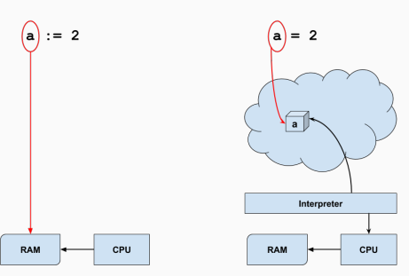

## Basic Types

### Keywords & symbols
Only 25 keywords; you may not use these as names:
```
    break       default     func    interface   select
    case        defer       go      map         struct
    chan        else        goto    package     switch
    const       fallthrough if      range       type
    continue    for         import  return      var
```
Plus a bunch of operators & symbols:
```
    +   &   +=  &=  &&  ==  !=  (   )
    -   |   -=  |=  ||  <   <=  [   ]
    *   ^   *=  ^=  <-  >   >=  {   }
    /   <<  /=  <<= ++  =   :=  ,   ;
    %   >>  %=  >>= --  !   ... .   :
    &^  &^  =
```

### Machine-native vs interpreted


### Predeclared identifiers
You can use these as names, shadowing the built-in meaning, but you really don’t want to do that!
- Constants:
```
    true false iota nil
```
- Types:
```
    int int8 int16 int32 int64
    uint uint8 uint16 uint32 uint64 uintptr
    float32 float64 complex64 complex128
    bool byte rune string error
```

- Functions:
```
    make len cap new append copy close delete
    complex real imag
    panic recover
```
### In Math
- Integers [can represent all the stars in the sky]
- Real numbers [fractions - average number of students in the class a a day]
  Real numbers are what we represent in floating points
- Complex Numbers - imaginary numbers

### Integers
“Unsized” integers default to the machine’s natural wordsize:
  - 64 bits on my laptop
  - 32 bits on my Raspberry Pi
int is the default type for integers in Go, even lengths

```
    Signed Unsigned
    int     uint
    int64   uint64
    int32   uint32
    int16   uint16
    int8    uint8
```
### Non-integers are represented in floating point:
• floating point numbers:
  ```float32``` 
  float64 - default
• complex (imaginary) floating point numbers:
  ```complex64 complex128```

Note: Don’t use floating point for monetary calculations!
    Try a package like Go money


### Simple Types
Special types:
• bool (boolean) has two values false, true
  these values are not convertible to/from integers!
• error: a special type with one function, Error()
  an error may be nil or non-nil
• Pointers are physically addresses, logically opaque
  a pointer may be nil or non-nil
  no pointer manipulation except through package unsafe


### Package Unsafe
- Interface with C language


### Initialization
Go initializes all variables to “zero” by default if you don’t:
• All numerical types get 0 (float 0.0, complex 0i)
• bool gets false
• string gets "" (the empty string, length 0)
• Everything else gets nil :
    • pointers
    • slices
    • maps
    • channels
    • functions (function variables)
    • interfaces
• For aggregate types, all members get their “zero” values

### Constants
Only numbers, strings, and booleans can be constants (immutable)
Constant can be a literal or a compile-time function of a constant
```
    const (
        a = 1 // int
        b = 2 * 1024 // 2048
        c = b << 3 // 16384
        g uint8 = 0x07 // 7
        h uint8 = g & 0x03 // 3
        s = "a string"
        t = len(s) // 8
        u = s[2:] // SYNTAX ERROR
    )
```